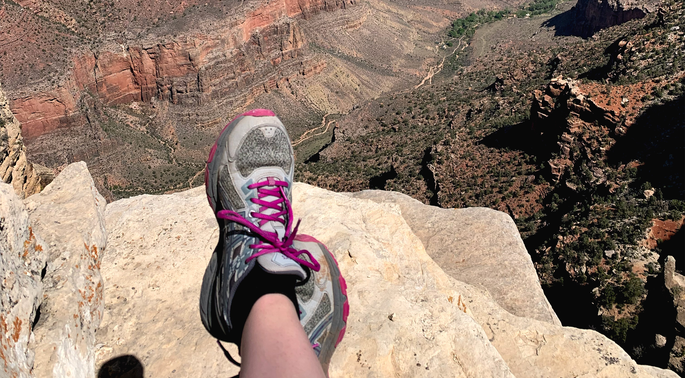

---
layout:layouts/base.njk 
title:Amy's Corner
---

 

  <article class="intro">
      

          <h1 class="intro_header">Creating my own little corner <em>in the world</em></h1>
      

      

        
Is this changing???

          
This is my space for faffing about and enjoying coding, writing, and cooking

      

      
  </article>

